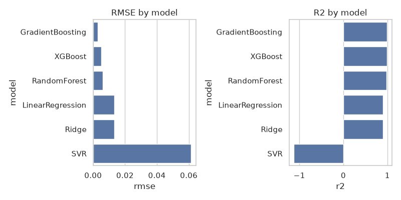
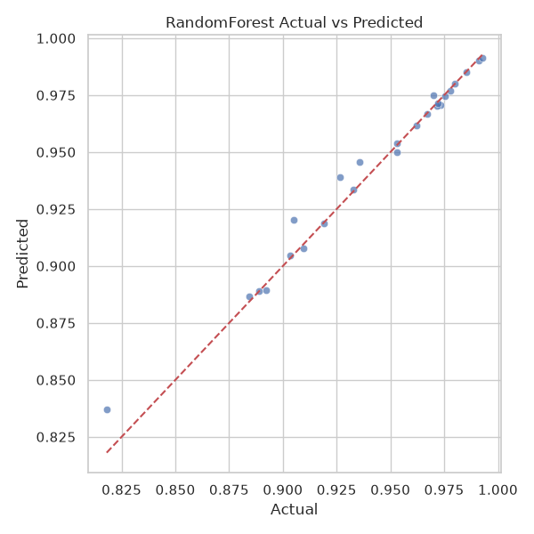
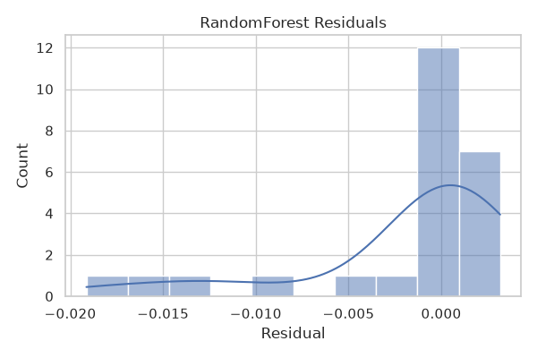

# R0101 回归训练脚本

用于读取 `R0101.csv`，选择 `PRES`、`ATM`、`TEMP` 等列作为输入特征，`MASSFRA` 作为标签，训练多种回归模型并生成可视化结果。

快速开始：

1. 创建虚拟环境并安装依赖：

```bash
python3 -m venv .venv
source .venv/bin/activate
pip install -r requirements.txt
```

2. 运行脚本：

```bash
python train_regressions.py --csv R0101.csv --out outputs
```

输出文件会保存到 `outputs` 目录，包含每个模型的预测图、残差图和 `results_summary.csv`。

## 演讲稿：机器学习回归流程

在这次机器学习任务中，我们围绕 `R0101.csv` 的数据，开展了以下关键步骤：

1. 数据读取与清洗
   - 使用脚本读取 CSV 文件，并自动识别多行表头。
   - 选定 `PRES`、`ATM`、`TEMP` 作为输入特征，`MASSFRA` 作为回归目标。

2. 特征工程与数据准备
   - 将特征列和标签列转换为数值类型。
   - 删除缺失值，确保训练和测试数据的稳健性。
   - 使用 `StandardScaler` 对特征进行标准化处理，提高模型收敛效果。

3. 模型选择与训练
   - 训练多种回归模型：线性回归、Ridge、随机森林、梯度提升机、SVR，以及可选的 XGBoost。
   - 对比模型表现，寻找最适合当前数据的回归方法。

4. 结果可视化
   - 绘制“实际值 vs 预测值”图，直观展示模型拟合效果。
   - 绘制残差直方图，分析误差分布与模型稳定性。
   - 汇总不同模型的 RMSE 和 R² 指标，比较模型性能。

## 图片示例说明

### 模型对比图



该图展示各个回归模型的 RMSE 与 R² 指标对比，便于快速判断哪个模型在当前数据集上表现最好。

### 实际值 vs 预测值



该图片以随机森林模型为例，横轴为真实 `MASSFRA` 值，纵轴为模型预测值。理想情况下，点应沿对角线分布，表明预测与真实值高度一致。

### 残差分布图



该图显示模型预测误差（残差）的分布情况。残差较集中的模型通常表示预测更稳定，若呈现近似正态分布，则说明误差较为随机且没有明显偏差。

注意：脚本会尝试处理多行表头（若CSV文件在前几行包含层级列名）。如果未能自动识别列名，请手动预处理CSV以包含 `MASSFRA` 列名和所需特征列。
